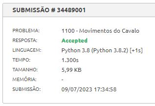
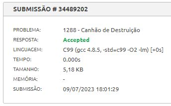
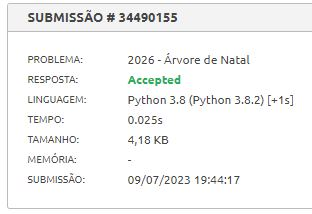
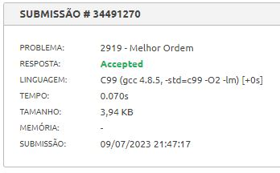

# PD_Exercicios_08

**Numero da Lista**: 8 
**Conteudo da Disciplina**: D&C 

## Alunos
| Matricula | Aluno                              |
| --------- | ---------------------------------- |
| 211031664 | Catlen Cleane Ferreira de Oliveira |
| 212002907 | Zenilda Pedrosa Vieira             |

## Sobre 
Escolhemos 4 do Beecrowd sobre a materia estudada. 

> Algoritmo de Bellman-Ford (menor caminho) - Nivel 5 - [1100 - Movimentos do Cavalo](1100/Beecrowd_1100_Movimentos_do_Cavalo.py) 
> Algoritmo da Mochila - Nivel 5 - [1288 - Canhao de Destruicao](1288/Beecrowd_1288_Canhao_de_Destruicao.c) 
> Algoritmo de Programacao Dinamica - Nivel 5 - [2026 - Arvore de Natal](2026/Beecrowd_2026_Arvore_de_Natal.py) 
> Algoritmo de Maior subsequencia crescente - Nivel 7 - [2919 - Melhor Ordem](2919/Beecrowd_2919_Melhor_Ordem.c) 

## Screenshots

 

 

## Video explicativo

[Apresentacao_PD.mp4](Apresentacao_PD.mp4)

## Instalacao 
**Linguagens**: Python  e C

## Uso 
Os exemplos do Beecrowd:

Para rodar basta clonar o repositorio e usar o comando no terminal (dentro da pasta do arquivo):

    python3 nome_arquivo.py < nome_arq_entradas.txt

ou (para os codigos em C)
    
    gcc -o nome_arquivo nome_arquivo.c
    ./nome_arquivo < nome_arquivo_entrada.txt

Outra forma de verificar o codigo e submete-lo ao juiz do Beecrowd:

[Beecrowd - 1100 - Movimentos do Cavalo](https://www.beecrowd.com.br/judge/pt/problems/view/1100) 
[Beecrowd - 1288 - Canhao de Destruicao](https://www.beecrowd.com.br/judge/pt/problems/view/1288) 
[Beecrowd - 2026 - Arvore de Natal](https://www.beecrowd.com.br/judge/pt/problems/view/2026) 
[Beecrowd - 2919 - Melhor Ordem](https://www.beecrowd.com.br/judge/pt/problems/view/2919) 

    
